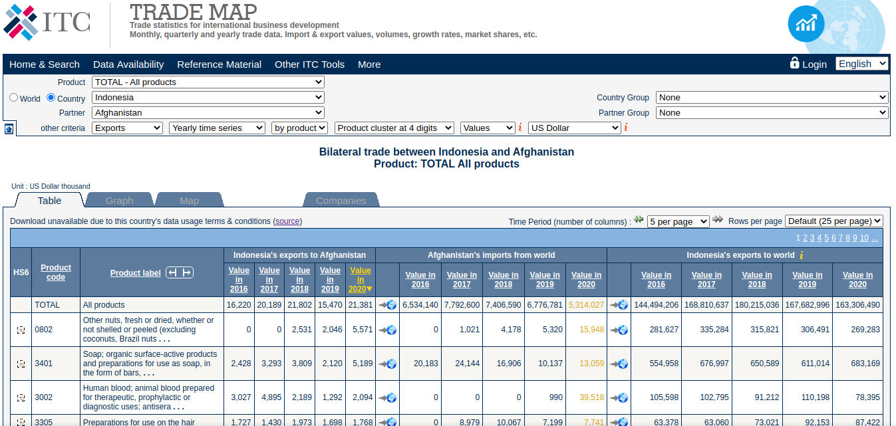
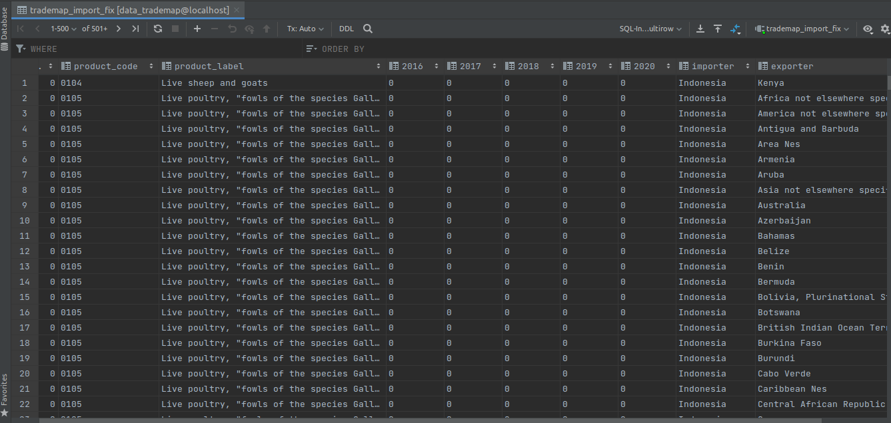
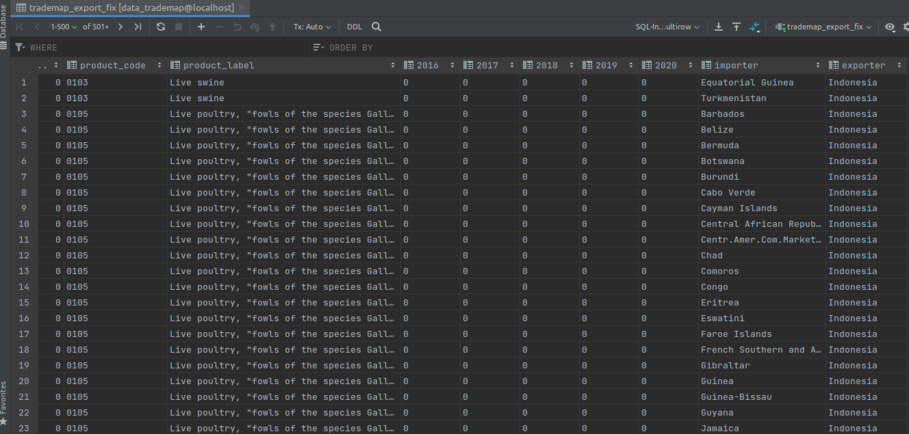

# Trademap  Bilateral Trade  Data Scraping v2 (4 Cluster) + PostgreSQL

<p align="center">
  
</p>
 

## **Overview**
In this project, we create web scraper with Selenium and  BeautifulSoup using python  and load the data into PostgreSQL.
 

 

 
 

## Project Files

```lib_scraping.py``` -> Import library that needed

```connect_db.py``` -> Connect to DB PostgreSQL

```scrape_data.py``` -> Data Extracting with BS4 and show on Dataframe pandas 

```session_browser.py``` -> Create session for webdriver selenium 

```trademap_importir.py``` -> Scrape for table importir trademap.org

```trademap_exportir.py``` -> Scrape for table exportir trademap.org

```notebook_version_scraping.ipynb``` ->  Jupyter Notebook Version


 
 

## Environment 
Python 3.6 or above

Selenium   
BeautifulSoup  


## How to run

run in this file  ```trademap_importir.py``` for scrape table importir or 
run in this file  ```trademap_importir.py``` for scrape table exportir


 


## Output  

<p align="center">
  
</p>
 

 ## Output  Data Import

<p align="center">
  
</p>
 
  ## Output  Data Export

<p align="center">
  
</p>
 